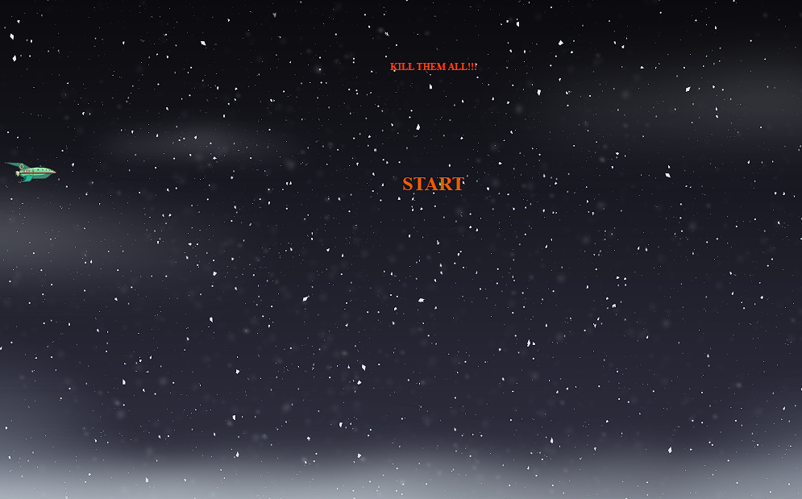

<h1 align="center">👾 Space Shooter 👾</h1>

Replica do jogo estilo space shooter dos 16 bits, baseado no desenho Futurama, desenvolvido durante um lab da DIO.  

  <a href="#-tecnologias">Tecnologias</a>&nbsp;&nbsp;&nbsp;|&nbsp;&nbsp;&nbsp;
  <a href="#-projeto">Projeto</a>&nbsp;&nbsp;&nbsp;|&nbsp;&nbsp;&nbsp;
  <a href="#-controles">Controles</a>&nbsp;&nbsp;&nbsp;|&nbsp;&nbsp;&nbsp;
  <a href="#-aprendizado">Aprendizado</a>&nbsp;&nbsp;&nbsp;|&nbsp;&nbsp;&nbsp;
  <a href="#memo-licença">Licença</a>

  

 

  

---

## 🚀 Tecnologias

Esse projeto foi desenvolvido com as seguintes tecnologias:

- HTML e CSS
- JavaScript
- Git e Github

---

## 💻 Projeto

Space shooter é uma replica dos jogos de 16 bits, baseado no desenho Futurama, onde a nave se move na horizontal e atira nos aliens.
Caso queira testar e atirar em alguns aliens, teste o projeto clicando no link abaixo.

[Acesse o projeto finalizado, online](https://Gustavo-Zamai.github.io/Space-Shooter)

---
## 🎮 Controles

- 🔛Space : Shoot
- ⬆️ Arrow up : Move up 
- ⬇️Arrow down : Move down

---

## 📑 Aprendizado

Esse projeto foi muito bom para praticar o Javascript e o posicionamento de elementos relative no CSS.

---

## 📝 Licença

Esse projeto está sob a licença MIT.

---

Feito com ♥ por Gustavo Zamai 👽🔫
